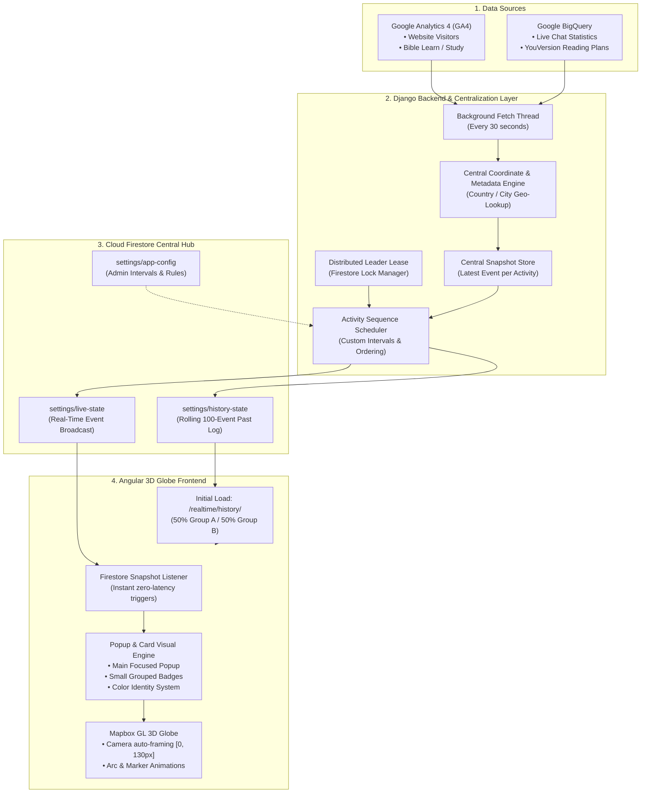

# Church Globe Visualization Platform
## System Architecture & End-to-End Data Flow Documentation

---

### Executive Summary

The **Church Globe Visualization Platform** is an enterprise-grade, real-time 3D geospatial dashboard that visualizes global ministry engagement. The system continuously ingests analytics and engagement metrics from **Google Analytics 4 (GA4)** and **Google BigQuery**, standardizes and enriches the data with geographic coordinates, and broadcasts synchronized real-time activity cards to an interactive 3D WebGL globe.

---

---

## 1. Data Ingestion & Activity Sources

The platform aggregates data across **four core engagement activities**, categorized into two balanced operational groups:

| Activity | Group | Source | Visual Identity | Description |
| :--- | :---: | :--- | :--- | :--- |
| 💬 **Chat** | **Group A** | BigQuery / GA4 | **Lavender / Purple** (`#f5f3ff`, `#4f46e5` border) | 1-on-1 mentorship and live pastoral chat engagements. |
| 📚 **Bible Study** | **Group A** | GA4 / BigQuery | **Mint Green** (`#ecfdf5`, `#10b981` border) | Course enrollments, lesson completions, and study milestones. |
| 🌐 **Website Visitor** | **Group B** | GA4 | **Pure White** (`#ffffff`, `#dbeafe` border) | Live website traffic, page views, and interactive visitor sessions. |
| 📖 **Bible Reading Plan** | **Group B** | BigQuery | **Pure White** (`#ffffff`, `#dbeafe` border) | Daily scripture reading plans and completion statistics. |

---

## 2. Centralization & Ingestion Pipeline

### A. Concurrent Snapshot Polling (Every 30 Seconds)
The backend runs background worker threads that concurrently fetch latest records from Google services without blocking request threads:
1. **GA4 Poller**: Queries GA4 Realtime APIs for active visitors and course progression events across configured properties.
2. **BigQuery Poller**: Queries aggregated tables (`echo_chat_statistics_combined`, `youversion_combined_language_statistics`) for the latest timestamps.

### B. Central Coordinate & Metadata Resolution
To guarantee visual consistency, all geo-resolution and data normalization happens **centrally on the backend**:
- **Country & City Matching**: Incoming event metadata is cross-referenced with a comprehensive global city-coordinate index (`worldcities.json`).
- **Data Enrichment**: Attaches accurate `[latitude, longitude]`, normalized country names, detected languages, and gender demographics.
- **Deterministic Event ID**: Generates a SHA-256 event fingerprint (`eventId`) ensuring exact deduplication.

### C. In-Memory Snapshot Store
The backend maintains an in-memory `SnapshotStore` holding the latest verified record for each of the four activities.

---

## 3. High-Availability Scheduling & Leader Election

In cloud containerized environments (such as Google Cloud Run or Kubernetes), multiple backend instances may run simultaneously. To prevent duplicate card emissions, the system employs **Distributed Leader Election**:

1. **Firestore Lease Lock**: Backend nodes attempt to acquire a transactional lease lock on `locks/scheduler-leader` with a 15-second expiration.
2. **Active Leader Instance**: Only the elected leader node evaluates interval timers and triggers live publishes.
3. **Automatic Failover**: If the leader restarts or experiences network partitions, a standby instance automatically assumes leadership within 5 seconds.

---

## 4. Real-Time State Synchronization via Cloud Firestore

The backend communicates with connected frontend clients using Google Cloud Firestore as a high-throughput, low-latency messaging layer:

1. **`settings/live-state` (Real-Time Pub/Sub)**:
   - When an activity is due, the leader writes the formatted card payload directly to this document.
   - Frontend clients listening via Firestore WebSockets receive the new card instantly without manual polling.
2. **`settings/history-state` (Rolling Event History)**:
   - Maintains an ordered array of the last 100 published cards.
   - When a new card is emitted, it is prepended and automatically trimmed.
3. **`settings/app-config` (Dynamic Configuration)**:
   - Stores admin-controlled settings (intervals, group counts, sequence ordering). Changes made via the Admin Dashboard take effect immediately without server restarts.

---

## 5. History API & 50/50 Group Balancing Algorithm

When a user opens or refreshes the globe application, the frontend calls `/realtime/history/` to preload past activity markers.

### Balanced Representation (50% Group A / 50% Group B)
To ensure equal visual representation on the 3D globe:
- **Group A (50 total cards)**:
  - 25 **Chat** cards
  - 25 **Bible Study** cards
- **Group B (50 total cards)**:
  - 25 **Website Visitor** cards
  - 25 **Bible Reading Plan** cards

### Intelligent Graceful Fallback
If any activity currently has fewer records in live telemetry (e.g., during off-peak hours), the backend dynamically fills the quota using rotating global location templates. This ensures the globe always opens with a full, vibrant, and perfectly balanced display.

---

## 6. Frontend Presentation & 3D Globe Engine

### A. Focused Main Card Presentation
- When a new event arrives, Mapbox GL performs a smooth camera flight (`flyTo`) toward the destination coordinate.
- **Camera Offset Calibration**: An intentional `[0, 130px]` camera offset positions the focal point dead-center in the visible viewport, preventing card overlap with the top navigation header and quotes banner.
- The main card displays user avatars, country flags, city/country names, language badges, and activity milestones.

### B. Grouped Cards & Small Past Marker Badges
- **Group Count Stacking**: Configurable group numbers (e.g., 4 users at a time) show grouped user avatars with a centered `"+X others"` badge.
- **FIFO Small Card Pipeline**: When a main card finishes its display duration, it smoothly transitions into a compact past activity badge on the globe, retaining its distinct color identity:
  - **Mint Green** for Bible Study / Learn
  - **Lavender / Purple** for Live Chat
  - **Clean White** for Website Visitors and Reading Plans

### C. Language & Data Sanitization
- Invalid or unmapped values (`NA`, `#NA`, `N/A`, `none`, `-`, `unknown`) are automatically filtered out so only genuine user languages are displayed.

---

## 7. Admin Dashboard & Dynamic Control Center

The platform provides a secured administration portal allowing ministry operators to manage system behavior in real time:

- **Per-Activity Intervals**: Adjust how frequently each activity appears (in seconds).
- **Per-Activity Group Counts**: Set the avatar stacking size for individual activities.
- **Custom Sequence Ordering**: Re-order the playback flow (e.g., Chat ➔ Study ➔ Website ➔ Reading).
- **Card Display Duration**: Control how long main popups remain pinned on the globe.
- **Show Past Records**: Configure the total number of background markers rendered simultaneously.
- **Instant Save Feedback**: Toast notifications confirm successful updates or alert administrators if network adjustments fail.

---

## 8. Recent Architecture Enhancements & Dynamic Grouping Flow

### A. 100% Dynamic Activity Grouping Architecture (`groupCount`)
- **Strict Settings-Driven Resolution**: Grouping behavior is completely decoupled from static UI constants. All grouping logic in `GroupingService` is strictly computed from the active `/api/settings/` payload.
- **Dynamic Group Display Mapping**:
  - `groupCount = 1`: Evaluated as individual person entries (`groupCount = 0`). The card renders cleanly as a single popup with **no** `& other` text.
  - `groupCount = 2`: Evaluated as pairs (`groupCount = 1`). Renders `& 1 other`.
  - `groupCount = N (N > 2)`: Evaluated as batches of $N$ (`groupCount = N - 1`). Renders `& (N - 1) others`.
- **Unified Live & Historical Data Pipeline**:
  - Raw BigQuery/GA4 historical records and incoming WebSocket live events are normalized upon ingestion.
  - Both streams dynamically apply the activity's active `groupCount` setting from `realtimeService.activities[currentActivity.key]`.
- **Continuous Background Synchronization**:
  - `GlobeViewComponent` runs a background sync interval (every 10 seconds) to fetch updated settings from `/api/settings/`.
  - Admin changes made in the dashboard immediately propagate to running globe slideshow loops without requiring a browser reload.

### B. Mapbox GL 3D Globe Lifecycle & Disposal
- **DOM & Marker Lifecycle**: Properly instantiates Mapbox markers via `new mapboxgl.Marker({ element })` and cleanly tears down DOM nodes and listeners on component destruction and logout.
- **Kinetic 3D Camera Transitions**: Slideshow seamlessly animates between cards using a 3-phase kinematic camera interpolation (zoom out $\to$ globe rotation $\to$ zoom in) scheduled via `requestAnimationFrame`.

### C. Modernized Admin Authentication & Modal UX
- **Password Visibility Toggle**: Interactive toggle (`fa-eye` / `fa-eye-slash`) allows administrators to inspect and verify entered credentials.
- **In-Card Loader Transition**: Replaced disruptive full-screen loader overlays with a sleek, localized card loader featuring glassmorphism blur and an animated button state (`Signing in...`), maintaining seamless visual continuity.

---

## 9. Summary of System Benefits

1. **Zero Data Latency**: Live Firestore triggers deliver engagement events across the globe within milliseconds.
2. **Reliable & Resilient**: Distributed leader locks eliminate duplicate broadcasts across multi-node server clusters.
3. **Balanced Visual Storytelling**: Strict 50/50 activity distribution highlights both community conversations (Chat & Study) and broad digital reach (Web & Reading).
4. **Client-Centric Customization**: Every interval, order, group count, and visual parameter can be tuned live through the admin interface without touching code.
5. **Robust Component Lifecycle**: Complete isolation between map instances, real-time queues, and admin sessions prevents memory leaks and state drift.

